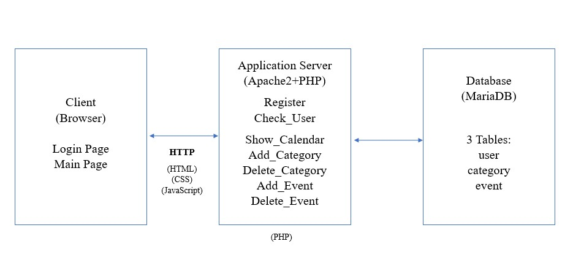
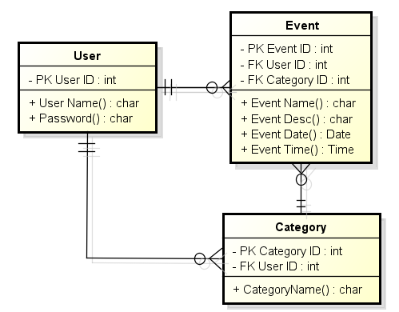

# Goals:
This project is a multi-user system that allows users to properly organise and schedule their day in such a way that allows them to properly navigate through the mundane tasks of everyday life. 
# Features :
  To install and use these features you may refer to this file: [HERE](../README.md)
  ### 1. Calendar :
  To keep track of all events scheduled utilising a date,month ,year format while also being able to generate specific events on the selected days and display the scheduled events without specificity.
  ### 2. Calendar Display :
  Functions in tandem with the calender function in that it generates both daily and monthly view.
  ### 3. Event :
  Allows users to register their desired event and at what time they wish to be reminded and on what day and what month.
  ### 4. Deadline Reminder :
  Allows users to see the upcoming events.
  ### 5. Category:
  Allows the users to generate their own catergorys in order to easily manage multiple scheduled events if desired.
  
# Architecture:
### Built with:
- HTML
- CSS
- JavaScript
- PHP
- MySQL

### Architecture 

The picture above shows the architecture with explanation below:  
Within this client server pattern software architecture, the **login page** as well as the **main page** will be presented as a **front end** and will utilise the **login.php** to get the user input for **username and password**, the system can then be **queried** for the whether or not the information given by the user has been stored in the **database**. Users also can store their data by click **"Register"** and it will generate **register.php** to get the user input for **username and password**, the system then will **store** the data to the **database**. 

The **main page** will also show the **calendar** that is generated by **calendar.php**, the main page will also feature the **category and event functions** which allows the user to **add and delete** both categories and events respectively which have generated by both **Add_Category.php** , **delete_category.php** and **Add_Event.php** , **delete_event.php**. For every added or deleted event or category will be updated within the database and will then be displayed on the main page which is generated through the calendar.php.

**Config** is used to establish connection from the web server to the database. **logout** is used to destroy the session.

### Database Tables
 

The picture above shows the database diagram with explanation below:  
**User** utillises a **username and password** to access the system to create and schedule events as they see fit , the user would also specifcy the **description** of **event** as well as the **date and time**. The **event** will be assigned an **event id** by the system which will be used as a **primary key** by the system to access the **user id** when needed. The user will also be able to create a **category** which will have a **category id** which can be used to store and access multiple events within said category.
