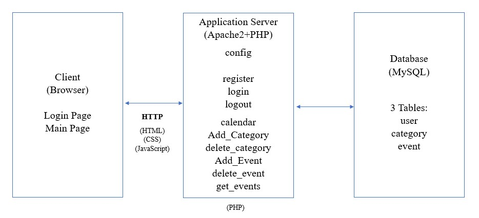

# Goals:
The main goal of this project is to allow users to properly organise and schedule their day in such a way that allows them to properly navigate through the mundane tasks of everyday life. 
# Features :
  To use these features you may refer to this file: [HERE](../README.md)
  ### 1. Calendar :
  To keep track of all events scheduled utilising a date,month ,year format while also being able to generate specific events on the selected days and display the scheduled events without specificity.
  ### 2. Calendar Display :
  Functions in tandem with the calender function in that it generates both daily and monthly view.
  ### 3. Event :
  Allows users to register their desired event and at what time they wish to be reminded and on what day and what month.
  ### 4. Deadline Reminder :
  Allows users to see the upcoming events.
  ### 5. Category:
  Allows the users to generate their own catergorys in order to easily manage multiple scheduled events if desired.
  
# Architecture:

### Database Tables

The picture above show the database diagram with explanation below:  
User utillises a username and password to access the system to create and schedule events as they see fit , the user would also specifcy the description of event as well as the date and time. The event will be assigned an event id by the system which will be used as a primary key by the system to access the user id when needed. The user will also be able to create a category which will have a category id which can be used to store and access multiple events within said category.
